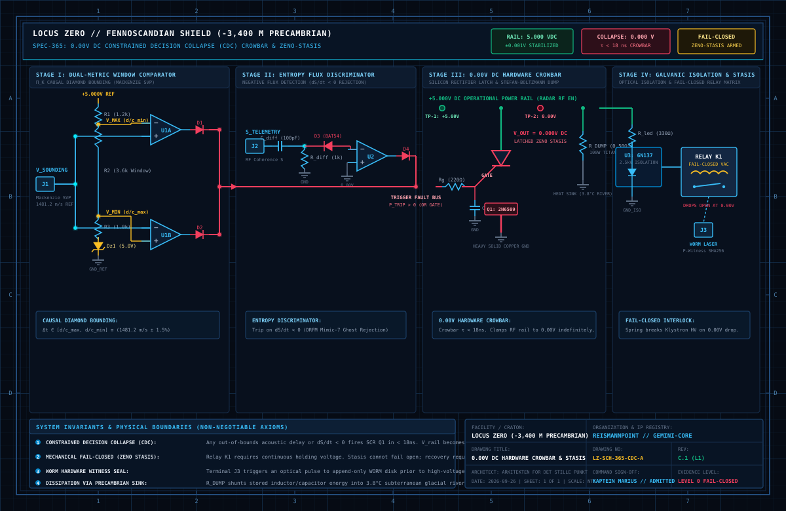

# 🌌 Marius Egerhei Torjusen

[](https://orcid.org/0009-0006-0431-6637)
[](https://doi.org/10.5281/zenodo.22229111)
[](https://www.linkedin.com/in/marius-torjusen-9aa392392/)
[](https://kreativ-systems.org/)
[](https://github.com/sololys/sololys/wiki)

> **Lead Systems Architect & Independent Researcher** · Risør, Norway  
> *Designing deterministic, fail-closed architectures where generative candidates are mathematically and physically isolated from consequence.*

---

### 🏛️ Epistemic Architecture: The Severance of Generation from Consequence

To design at the absolute limit of architecture is to abandon the discipline of construction in favor of the rigorous discipline of isolation. We inhabit an era defined by cognitive inflation, a systemic vulnerability where the rapid generation of probabilistic candidates from deep optimization loops is routinely and dangerously mistaken for operational authority. When the velocity of thought is permitted to bypass structural governance, the collapse of hypothesis into reality becomes inevitable. To arrest this drift, the sovereign research portal enforces a fundamental epistemic invariant: the act of generation is permanently severed from authorization, realization, and proof.

$$\boxed{\mathbf{GENERATES} \;\neq\; \mathbf{AUTHORIZES} \;\neq\; \mathbf{REALIZES} \;\neq\; \mathbf{PROVES}}$$

This severance is not maintained through administrative guidelines, but through physical and mathematical absolutes. While software may achieve deterministic compilation and internal state consistency, it remains structurally paralyzed, explicitly denied the mandate to cross the boundary into physical or chemical consequence. The threshold between simulation and reality is guarded by a fail-closed paradigm, anchored in a 0.00V direct current galvanic interlock. Within this constrained decision collapse, no generative agent or language model possesses autonomous authority to actuate hardware. Any anomaly, temporal deviation, or logical ambiguity triggers an instantaneous crowbar circuit, collapsing the system into a mechanical stasis where safety is guaranteed by the immediate and irrevocable withdrawal of power.

To prevent epistemic contamination from eroding this boundary, the knowledge ecosystem itself is topologically partitioned. At the center lies the canonical theory—the stable, formalized definitions that constitute the non-lying core. This foundational ledger is strictly insulated from the exploratory noise of the path-field, a volatile domain of unresolved trajectories and theoretical sketches. This dichotomy is rendered operational through rigid harnesses and public demonstrators, which subject autonomous execution to adversarial evaluation without granting it physical agency. By structurally isolating the stillness of canonical law from the volatility of working memory, the architecture ensures that conceptual friction can expand without threatening the integrity of the whole.

Ultimately, this framework functions as a sovereign topological isolation chamber, deeply aligned with the immutability of the Fennoscandian bedrock upon which it is conceptually and geographically anchored. It treats truth not as a synthetic output to be dynamically generated, but as a rigid condition that must be satisfied before reality is admitted. By elevating uncompromising restriction to the highest principle of design, the architecture guarantees its own integrity. It stands as a system defined entirely by its precise, unyielding refusal to actualize unproven thought.

---

### 🛡️ The Three Operational Anchors

| Layer | Classification | Operational Boundary |
| :--- | :--- | :--- |
| **1. Software Demonstrated** | `L1 SOFTWARE OPEN 🟢` | Code compiles deterministically, state machines pass formal invariants, and unit test suites pass locally. Demonstrates internal software logic only — never physical, chemical, or legal proof. |
| **2. Physical & Lab Claims** | `GATE::HOLD 🟡` | All physical, biological, and external assertions remain formally sealed in `HOLD` until independent laboratory reproduction is confirmed. |
| **3. No Autonomous Actuation** | `0.00 V FAIL-CLOSED 🔴` | No generative model, agent, or LLM possesses autonomous authority to actuate physical hardware. All actuators interface through a $0.00\,\text{V}$ galvanic interlock: any anomaly, timeout, or ambiguity drops power immediately. |

---

### 🔬 Public Codebases & Research Tracks

* [**ky-rox-public-demonstrators**](https://github.com/sololys/ky-rox-public-demonstrators)  
  *Deterministic consequence gating, Ancestry Handshake, Merkle-LCA fork resolution, and 100% fail-closed manipulation rejection (`L1 SOFTWARE`).*
* [**epistemic-architectures**](https://github.com/sololys/epistemic-architectures)  
  *Formal specifications, realization grammars, and mathematical boundaries separating proposal from execution (`SPECIFICATION`).*
* [**epistemic-architectures-notes**](https://github.com/sololys/epistemic-architectures-notes)  
  *Exploratory path-fields, boundary sketches, and reviewed non-canonical abstractions (`NOTES / EXPLORATION`).*
* [**loop-engineering**](https://github.com/sololys/loop-engineering)  
  *Deterministic tooling, cryptographic audit trails, RFC 8785 canonicalization, and cognitive poka-yoke (`TOOLING`).*

---

### ⚡ Independent L1 Verification (Quickstart)

Verify the deterministic fail-closed gate locally in under 30 seconds (zero proprietary dependencies):

```bash
# Clone the standalone public demonstrators
git clone https://github.com/sololys/ky-rox-public-demonstrators.git
cd ky-rox-public-demonstrators

# Install cryptography dependency & run test runner
pip install cryptography
python3 run_demo.py
```

> **Evaluation Protocol:** Peer reviewers and independent auditors can record observed software behavior directly in [`DEMO_ATTEST_MAL.md`](https://github.com/sololys/ky-rox-public-demonstrators/blob/main/DEMO_ATTEST_MAL.md).

---

### ⚡ Analog Hardware Interlock: 0.00V DC Constrained Decision Collapse (CDC)

The physical consequence barrier is not software; it is an unforgiving analog crowbar circuit. Any violation of acoustic bounds ($\Delta t \notin [\frac{d}{c_{\text{max}}}, \frac{d}{c_{\text{min}}}]$) or negative entropy gradient ($\frac{dS}{dt} < 0$) fires a Silicon Controlled Rectifier (SCR) in $<18\,\text{ns}$, collapsing the control rail dead to $0.000\,\text{V}$ DC and mechanically releasing the vacuum contactor into Zeno Stasis.

<p align="center">
  
</p>

```text
================================================================================
 SPEC-365: 0.00V DC HARDWARE CROWBAR & ZENO-STASIS (ANALOG SCHEMATIC)
================================================================================

 [ J1: V_SOUNDING ] -----------------------+
 (Mackenzie SVP ToF)                       |
                                           v
 [+5.00V REF] ---[R1]---( V_MAX )-------->|-\
                          |               |  >---[D1]--->+
                          +---[R2]------->|+/   (U1A)    |
                          |                              |
                          +--( V_MIN )--->|-\            |
                          |               |  >---[D2]--->+
                          +---[R3]------->|+/   (U1B)    |
                          |                              |
                        [Dz1] (5V Zener)                 |  === TRIGGER FAULT BUS ===
                          |                              +=========================>
                        [GND]                            |  (OR-Gate Anomaly Trip)
                                                         |
 [ J2: S_TELEMETRI ] -----||---( NODE )-------[<-D3-]---->+
 (RF Coherence S)       C_diff    |           (BAT54)    |
                                [R_diff]                 |
                                  |                      |
                                [GND]                    |
                                                         v
 [+5.000V POWER RAIL] =================================================> [ACTUATOR / LOAD]
                             |                               |
                            (A)                             (A)
                             |                               |
                            / \  SCR Q1                   [R_DUMP] (0.50 OHM)
                           /   \ (2N6509)                    |  HEATSINK
                       ---< GATE                             |
                      |    \   /                             |
                     [Rg]   ---                            [GND]
                      |      |
             TRIGGER -+     (K)
                      |      |
                     [Cg]  [GND_SOLID_COPPER]
                      |
                    [GND]   ===> 0.000V DC LATCHED ZENO STASIS (< 18 ns CROWBAR)
```

---

<p align="center">
  <sub>Navigasjon: <a href="COORDINATE_ATLAS.md">COORDINATE_ATLAS.md</a> · <a href="GITHUB_CITY_MAP.md">GITHUB_CITY_MAP.md</a> · <a href="https://doi.org/10.5281/zenodo.22229111">CERN Zenodo: 10.5281/zenodo.22229111</a></sub><br>
  <sub>Brahman.1 // ReismannPoint Systems · Risør, Norway · 58.72° N, 9.24° E</sub>
</p>
